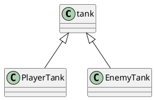
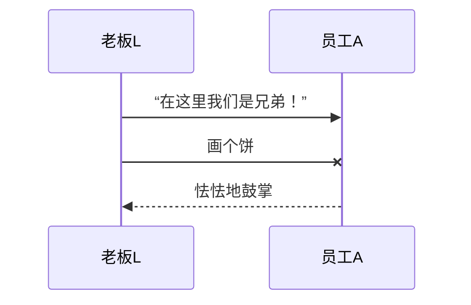
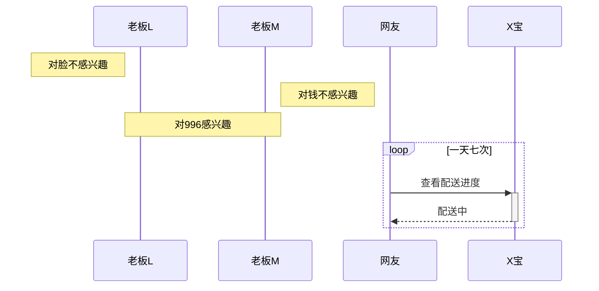
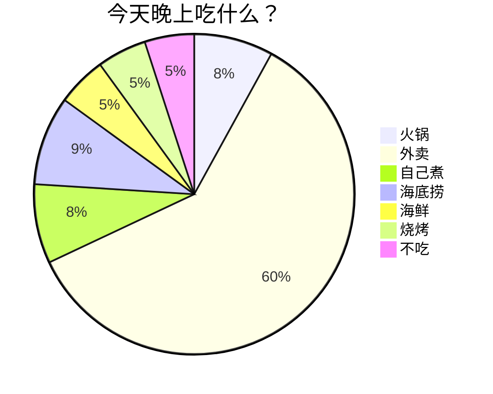
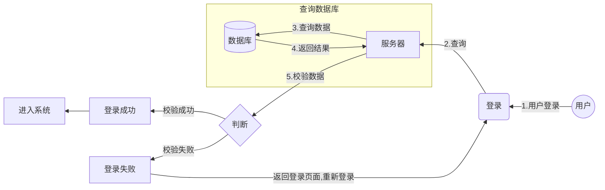

# diff 代码块

```diff
const unique = (arr)=>{
- return Array.from(new Set(arr))
+ return [...new Set(arr)];
}
```

# 待办(ctrl+shift+x)

- [ ] [ ]

# 折叠

```
<details>
<summary>展开查看规范</summary>
这是展开后的内容1
</details>
```

<details> <summary>展开查看规范</summary> 这是展开后的内容1 </details>

# puml 画图（需要插件）



# mermaid 流程图

```
sequenceDiagram
	participant 老板L
	participant 员工A

	老板L ->> 员工A : “在这里我们是兄弟！”
	老板L -x 员工A : 画个饼
	员工A -->> 老板L : 怯怯地鼓掌
```











# flow流程图

```flow
\```mermaid
flowchat
st=>start: Start:>http://www.google.com[blank]
e=>end:>http://www.google.com
op1=>operation: My Operation
sub1=>subroutine: My Subroutine
cond=>condition: linear or polynomial :>http://www.google.com
io=>inputoutput: catch something...
para=>parallel: 3 possibilities

st->op1->cond
cond(true)->io->e
cond(false)->sub1(right)
sub1(right)->para
para(path1, top)->cond
para(path2, right)->op1
para(path3, bottom)->e
\```
```

