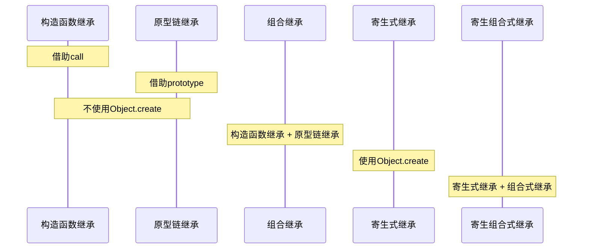

# JS继承
## 原型链继承
> 缺点：子类共享父类的状态
```javascript
function Parent() {
  this.path = []
}
function Child() {
  
}
Child.prototype = new Parent(); //原型链继承
const child1 = new Child();
const child2 = new Child();
child1.path.push(1);
console.log(child1.path===child2.path); //原型链继承方式所有子类共享父类的状态
```
## 构造函数继承（借助call继承）
> 缺点：子类无法共享父类原型方法
```javascript
function Parent1() {
  this.name = "parent1";
}
Parent.prototype.getName = function () {
  return this.name;
}
function Child1() {
  Parent1.call(this);
  this.age = 18;
}
const child3 = new Child1();
child3.getName();  //报错，借助call继承无法获取父类原型上的方法。
```
## 组合继承（原型继承 + call继承）
> 缺点：父类多进行一次构造，造成了性能开销
```javascript
function Parent2() {
  this.name = "parent2"
}
Parent2.prototype.getName = function () {
  return this.name;
}
function Child2() {
  Parent2.call(this);
  this.age = 18;
}
Child2.prototype = new Parent2();
Child2.prototype.constructor = Parent2;
const child4 = new Child2();
const child5 = new Child2();
```
## 原型式继承（借助Object.create）
> 缺点：子实例可能会篡改父实例的属性内容
```javascript
let parent3 = {
  name:"parent3",
  path:["p1","p2"],
  getName:function () {
    return this.name;
  }
}
let child6 = Object.create(parent3)
child6.name = "child6";
child6.path.push("p6");
let child7 = Object.create(parent3);
child7.path.push("p7");
console.log(child6.name); //子实例重写属性
console.log(child6.name===parent3.getName());
console.log(child7.name); //子实例继承属性
console.log(child6.path===child7.path); //子实例共享父实例的属性
```
## 寄生式继承（接着Object.create）
> 缺点：子实例可能会篡改父实例的属性内容
```javascript
let parent4 = {
  name:"parent4",
  path:["p4"],
  getName:function () {
    return this.name;
  }
}
function clone1(original) {
  let clone = Object.create(original);
  clone.getPath = function () {
    return this.path;
  }
  return clone;
}
let child8 = clone1(parent4);
console.log(child8.getName());
console.log(child8.getPath());
```
## 寄生组合式继承（extends关键字做法）
```javascript
function clone(parent,child) {
  child.prototype = Object.create(parent.prototype);
  child.prototype.constructor = child;
}
function Parent5() {
  this.name = "parent5";
  this.paly = [1,2,3];
}
Parent5.prototype.getName = function () {
  return this.name;
}
function Child6() {
  // 子类构造函数中调用父类构造函数，组合的方式添加属性
  Parent5.call(this);
  this.friends = "child6";
}
//子类原型是父类原型的实例
clone(Parent5,Child6);
Child6.prototype.getFriends = function () {
  return this.friends;
}
let person6 = new Child6();
console.log(person6);
console.log(person6.getName());
console.log(person6.getFriends());

```
# 总结
