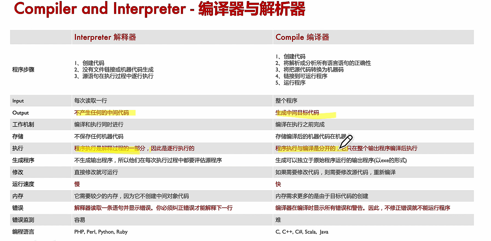
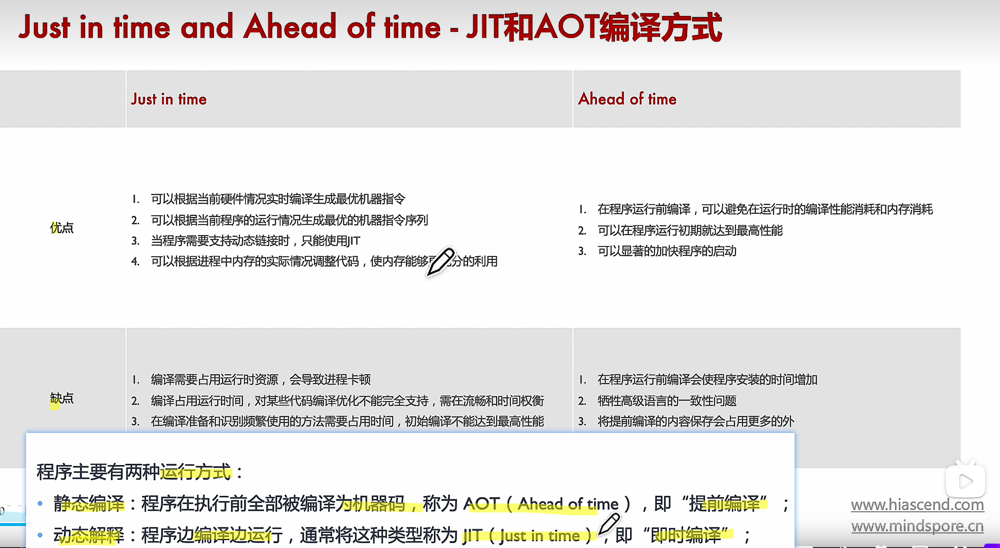
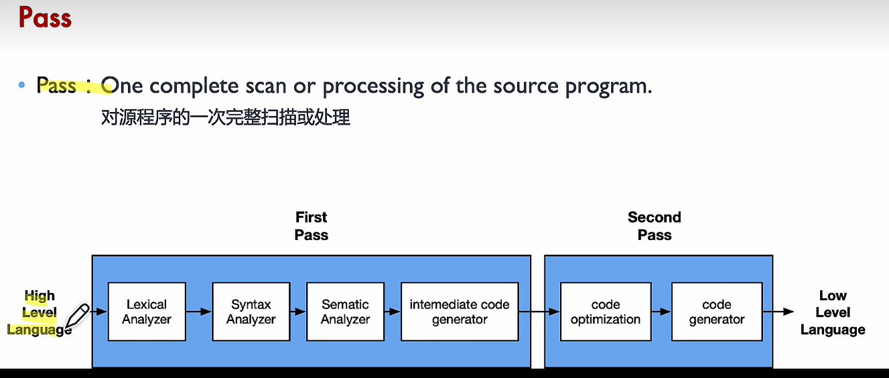
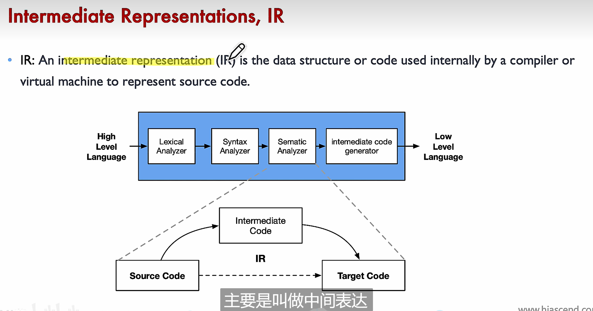
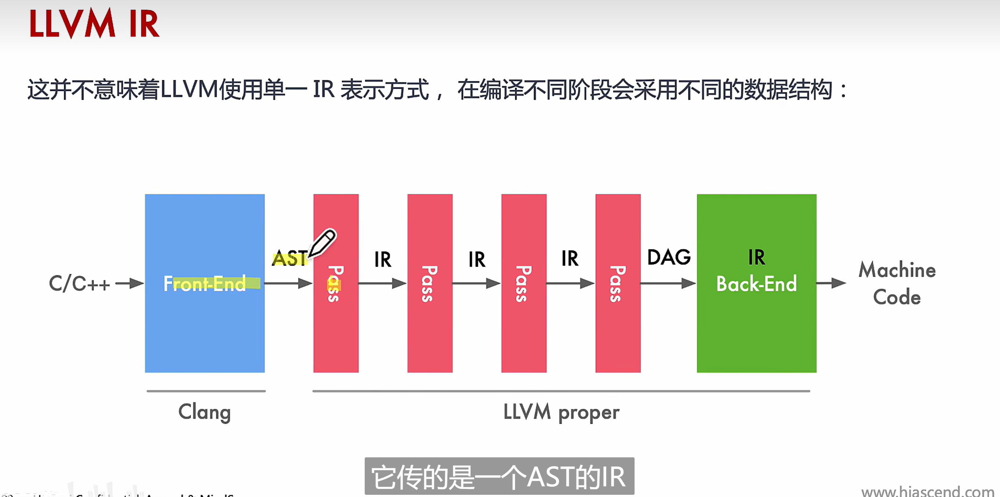
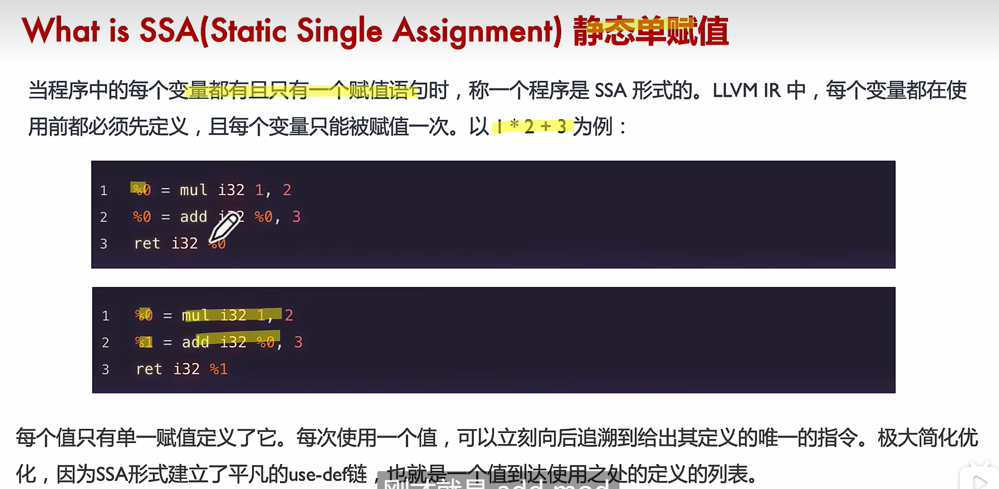

[资料链接](https://github.com/chenzomi12/DeepLearningSystem )
# 编译方式
- 静态编译AOT：静态编译需要通过编译器将源代码编译为机器码，以便于在目标平台上直接使用。
- 动态解释JIT：动态解释需要通过解释器一边解释编译一边执行。
# 编译器与解析器

# JIT和AOT

# Pass扫描

# IR

# 编译器的基本构成
- Source Code原代码 ---- Front-End编译前端 ---- Optimizer中间代码优化 ---- Back-End编译后端 ---- Machine Code机器码
- Front-End：编译器前端，主要用于对源程序进行一些转化，负责：词法分析、语法分析、将原代码转化为抽象语法树
- Optimizer：中间优化，基于语法树进行IR优化，使得代码更加高效，包括剔除dead code等
- Back-End：编译器后端，通过语法树语义分析生成机对应硬件的器码
# 编译器的历史
- 最早的编译器是gcc，可以支持跨平台交叉编译、并且支持多种语言如：C、C++、Java等
- 不过gcc的扩展性很差，仓库体积庞大不利于作为工具被扩展，编译出来的机器码耦合严重，于是就有了llvm
- llvm通过IR将高级语言和不同的机器码语法之间的差异进行屏蔽，假设要增加支持一个新的硬件的机器码，只需要改硬件对接IR即可
- 还有一个比较核心的概念就是llvm库的概念，llvm是一个工具集合，这使得它可以被很好的被扩展使用
# LLVM IR

- LLVM IR作为一种编译器IR，它的两个基本原则指导着整个核心库的开发：
- 1、SSA（静态单赋值）的方式表示，代码组织为三地址指令序列和无限寄存器让优化能够快速执行，两个重要特征为：代码组织为三地址指令序列、寄存器数量没有限制。
- 2、整个程序的IR存储到磁盘让链接时优化易于实现
# SSA静态单赋值

- SSA静态单赋值是LLVM-IR中间表示的一个重要特性，它使得每个值只有单一赋值定义了它，每次使用一个值，可以立即向后追溯其定义的唯一指令，是用于代码优化的产物。
# 三地址码

# AI编译器